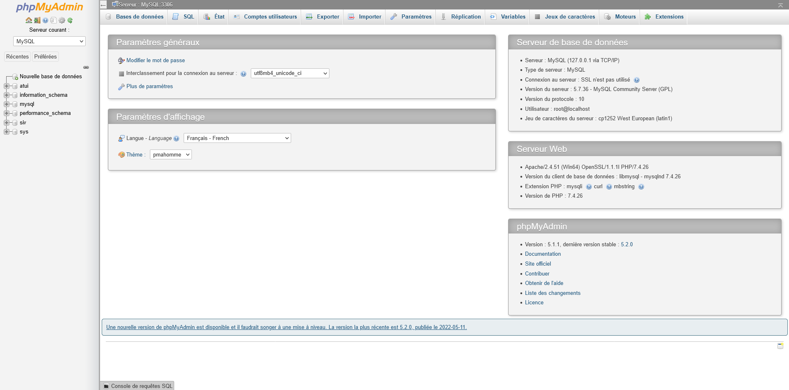
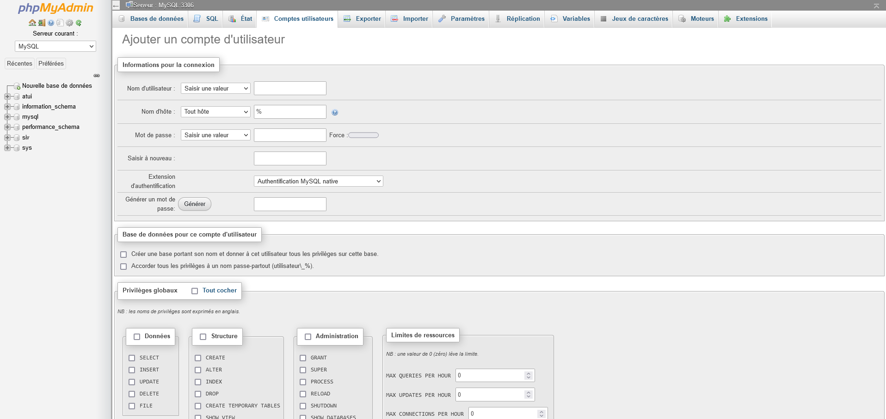

# Siv V2

Siv V2 est tous simplement un site web pour gérer les délcrations de véhicules. 


## Description

Créé en 2022

actuellement a la 2 version du siv , il rajouter une meilleur sécurisation est structure du projet. 

objectif : faciliter les déclaration. (Déclaration achat, déclaration de cession, demande d'immatriculation.)

## Structure 

Un fichier public est private.

Public => Fichier qu'on peut y acceder on moidifiant l'url.

Private => Fichier qu'on ne peut pas y acceder on moidifiant l'url.

### Public
Vous trouverais tous les fichiers de connexion , fichier de la page d'acceuille.. est les différente formalité.

### Private
A l'intérieur du fichier private vous trouverer les élémoment les plus importants. 

bdd => Gestion de connexion a la base.

Gestion de session => tous les fichiers qui gérer la connexion/déconnection.

javascript => tous les codes javascript du site.

src => Contient tous les images utiliser.

## Installation du projet

### Etape 1 - Installer un serveur local
Vous-pouvez installer un serveur en local. 

Je vous conseille wamp pour window. Voila le  lien 

```https://www.wampserver.com/```

Ensuite démarrer le .exe est fait l'installation classique.


### Gérer l'erreur MSCVR110.dll

A la fin de l'installation vous pourrez trés bien tomber sur cette erreur. pour palier a ça voici une vidéo sur youtube

qui montre comment faire : ```https://www.youtube.com/watch?v=XoCV1ANmRrw&```

### Etape 2 - Installation du projet dans wamp
En premiet tant cloner le dépots. 

```git clone https://github.com/Rayan-El-Manssouri/sivV2 ```

Déplacer le aller dans le l'exporateur de fichier ou alor petit racourci : ```Win + E ```

Aller dans Disque Local => wamp64 (Si vous êtes en 64 bits.) => www => Déposer le fichier sivV2 ici.


Est voila ! maintenant faite un simple localhost/sivV2 est vous aurez acces aux fichier.


### Installation de l'utilisateur pour que tous fonctionne.

Pour être sûre que tous fonctionne, faut rajouter un utilisateur dans la bdd.

Rendez vous sur le panel phpmydamin :



Cliquer sur le bouton Compte utilisateur => ajouter un compte utilisateur. alors copier juste ce lien :


```http://localhost/phpmyadmin/index.php?route=/server/privileges&adduser=1```

Vous êtes censer arriver ici :



Les information du compte utilister :

Identifiant: ```test```

Mot de passe : ```root```


## Contribuer aux projet.

Pour ceux qui aimeront contribuer aux projet , ne pourront pas. Seuls les amis les plus proches ou alors des professionelle que je connais aurons acces.

Mais **Personne d'autre.**

## Nous contacter

Vous pourer nous contacter sur les réseaux comme instagram : 

```https://instagram.com/rayan_el_man``` 

Ou alor gmail : 

```liviackerman69@gmail.com```

