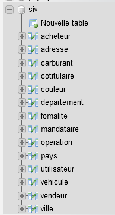
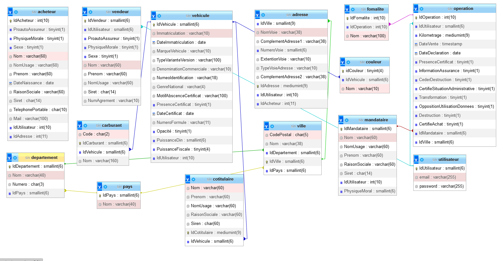
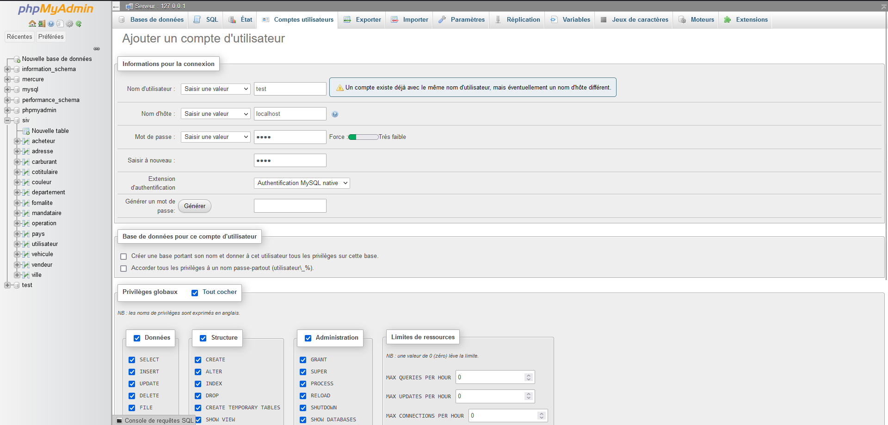
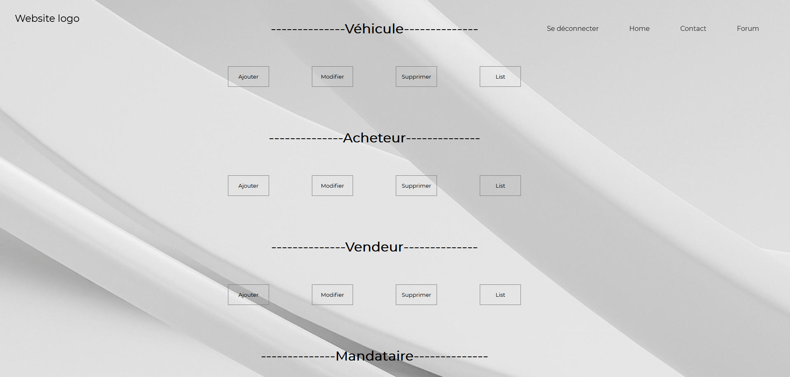

<h1>Siv</h1>

Siv est tous simplement un site web qui vous permet de gérer les déclarations de voitures !

 
<h1>Installation du serveur en local</h1>

Pour pouvoir l'utiliser il vous faudra copier le code a l'intérieur de Gestion / DDL.sql , puis le coller a l'intérieur de votre interface 
 

phpmyadmin de votre serveur en local.

 

Normalement une fois tous exécuter vous êtes censé avoir toute ces tables :

 

 

Est à l'intérieur de ces tables vous devrez avoir ceci :

 

Une fois tous ça aller sur internet est faite localhost/sivV2, une fois a l'intérieur vous êtes censé arrivé ici :

 

Connecter vous sur le panel avec un compte enregistrer dans la table "utilisateur"

 
<h1>Gestion compte utilisateur en cas de problème</h1>
 

Si rien ne ce passe rajouter une nouveaux utilisateur en local. cliquer sur "nouvelle base de donné", "Compte utilisateur" est compléter comme ceci :

 

 

Le mot de passe est : root

 
<h1>Explication des pages</h1>
 

Une fois connecter vous serez rediriger sur cette page :

 

 

A partir de la vous pourer rajouter un acheteur,vendeur,mandataire ou un véhicule.

 

Une fois avoir mis toute information vous pourrez générer un mandat , une déclaration d'achat..

 

Ceci est encore en construction il reste a finaliser les pdf est les options "supprimer", "list"

<h1>Nos réseaux</h1>
    <ul>
        <li><a href="https://www.instagram.com/rayan_el_man/">Instagram</a></li>
        <li>
Gmail : liviackerman69@gmail.com 
</li>
    </ul>
     
    
Vous pourrez toujours me contacter pour quelconque information.

